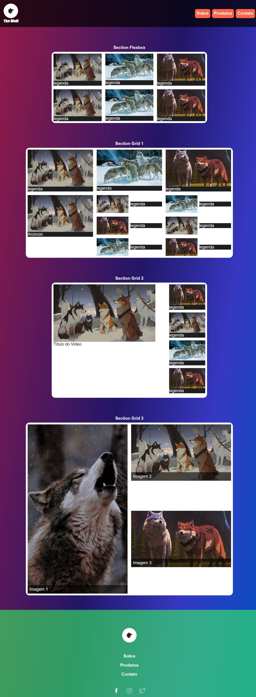
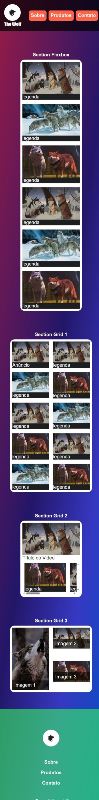

# The Wolf - Galeria de Imagens

## Descrição

Projeto criado para treinar conceitos, propriedades e fixar display flex e grid no CSS!

## Conceitos trabalhados e fixados no projeto:

* Display Flex; ✅
* Display Grid; ✅
* Responsividade; ✅
* Cor em gradiente para o fundo da página; ✅
* Navegação pela página com links; ✅
* Interação com o usuário ao passar o mouse sobre elementos ✅

## Design Desktop

    

## Design Mobile

    

